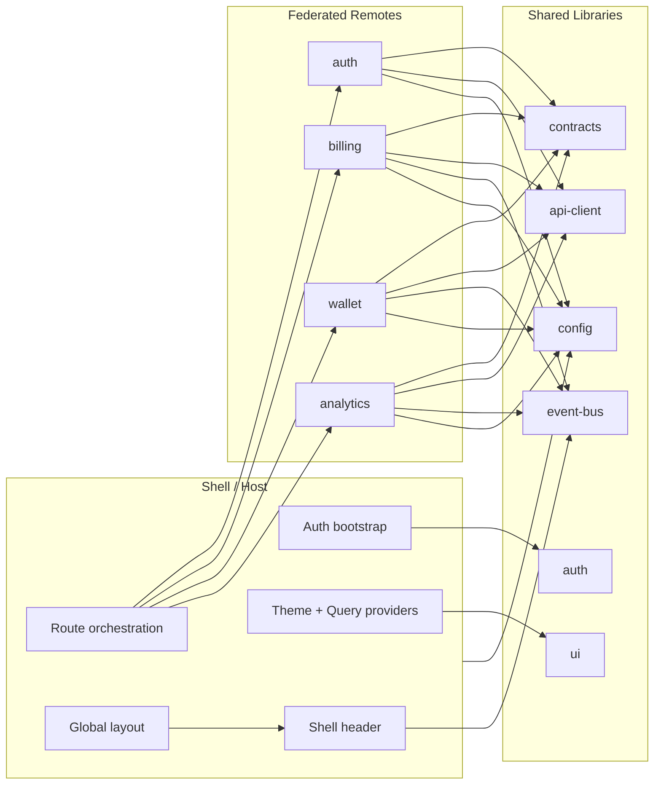

# Architecture Notes

This document explains the architectural intent behind `modular-payments-console` and how the repository is meant to be discussed in a technical interview.

## Why Microfrontends Here

The goal is to demonstrate how a frontend platform can split platform concerns from domain concerns without fragmenting the developer experience.

Microfrontends were chosen because they help model situations where:

- different teams own different product domains
- some domains change faster than others
- the host application needs a consistent platform layer
- runtime composition matters more than simple folder organization

## High-Level View

## What Problems This Solves

This architecture is meant to solve:

- platform consistency without forcing all domains into one app layer
- team separation without duplicating auth, layout and theme setup
- independent evolution of routes and screens inside each domain
- faster validation through Nx affected pipelines
- a cleaner interview story around ownership boundaries

## Shell Responsibilities

The shell owns:

- public vs protected navigation
- auth session bootstrap
- shared providers
- shared layout chrome
- loading and error handling for remote composition
- lightweight page-context consumption from remotes

The shell does not own:

- billing rules
- wallet rules
- analytics rules
- remote-internal routing decisions

## Remote Responsibilities

Each remote owns:

- its own route tree
- its own pages
- domain-local state
- future domain-specific workflows

Each remote does not own:

- global layout
- auth bootstrap
- shell navigation chrome
- cross-domain shared contracts

## Shared Libraries vs Remotes

Use a shared library when the code is:

- stable
- reusable across multiple domains
- not tied to one remote's business rules

Use a remote when the code is:

- domain-specific
- expected to evolve independently
- part of a team's product area

That is why the workspace has `ui`, `contracts`, `auth`, `api-client`, `event-bus` and `config` as shared libs, but keeps billing, wallet and analytics screens inside remotes.

## How Separate Teams Could Work Here

An example split:

- platform team owns `shell`, shared providers and cross-cutting libs
- billing team owns `apps/billing`
- wallet team owns `apps/wallet`
- analytics team owns `apps/analytics`

The workflow stays practical because:

- each app can run standalone
- each app can be built in isolation
- Nx affected highlights which teams are impacted by shared-library changes
- the shell can remain stable even while a remote evolves

## Independent Deploy Possibility

This repository is local-first, but the model supports independent deployment.

One possible production path:

- each remote builds and publishes its own artifact
- the shell resolves remote entrypoints from environment-aware config
- teams release on their own cadence
- CI validates only affected projects plus a small shell compatibility check

That keeps deploy independence possible without forcing completely separate repositories.

## Avoiding Excessive Coupling

Coupling is managed here by a few explicit rules:

- the shell imports remote `./Routes`, not remote internal files
- remotes do not import each other
- business rules do not move into shared libs just because they are reused once
- event bus messages stay small and UI-oriented
- route metadata lives in `config`, not spread across hard-coded shell conditionals

## State Boundaries

### Local State

Use local state for:

- forms
- filters
- tabs
- transient domain interactions

### Shared Global State

Use shared global state only for platform concerns such as:

- current authenticated session
- persisted theme choice

### Auth

Auth is deliberately centralized because every protected remote depends on it, but the auth flow itself still lives inside the `auth` remote.

### Event Bus

Use the event bus for:

- shell header context
- breadcrumb hints
- lightweight shell/remote coordination

Do not use the event bus as a permanent domain store or as a replacement for route contracts and API contracts.

## When Not to Use Microfrontends

Do not reach for this architecture when:

- a single small team owns the entire product
- deployments are always synchronized anyway
- runtime composition adds more complexity than organizational value
- shared design and domain rules are too tightly coupled to separate cleanly

In those cases, a modular monolith is often the better choice.
